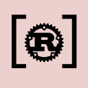

# [ DOCORE / VSCode Extension-Pack][docore-vscode-extension-pack-gh-repo]

## Rust pack

| #   | extension name                                                                                                                                                                                                            | version                                 | downloads                               |
| --- | ------------------------------------------------------------------------------------------------------------------------------------------------------------------------------------------------------------------------- | --------------------------------------- | --------------------------------------- |
| 1   | [ Rust Symtax][l-rust-syntax]   | ![rust-syntax][v-rust-syntax]           | ![rust-syntax][d-rust-syntax]           |
| 2   | [ Rust Analyzer][l-rust-analyzer]    | ![rust-analyzer][v-rust-analyzer]       | ![rust-analyzer][d-rust-analyzer]       |
| 3   | [ Cargo][l-cargo]                                 | ![cargo][v-cargo]                       | ![cargo][d-cargo]                       |
| 4   | [ Better TOML][l-better-toml]                 | ![better-toml][v-better-toml]           | ![better-toml][d-better-toml]           |
| 5   | [ Even Better TOML][l-even-better-toml] | ![even-better-toml][v-even-better-toml] | ![even-better-toml][d-even-better-toml] |
| 6   | [ Crates][l-crates]                         | ![crates][v-crates]                     | ![crates][d-crates]                     |
| 7   | [ Search crates.io][l-search-crates-io]      | ![search-crates-io][v-search-crates-io] | ![search-crates-io][d-search-crates-io] |
| 8   | [ CodeLLDB][l-code-lldb]                      | ![code-lldb][v-code-lldb]               | ![code-lldb][d-code-lldb]               |

<!-- links -->

[docore-vscode-extension-pack-gh-repo]: https://github.com/docore/vscode-extension-pack
[l-rust-syntax]: https://marketplace.visualstudio.com/items?itemName=dustypomerleau.rust-syntax
[v-rust-syntax]: https://vsmarketplacebadges.dev/version-short/dustypomerleau.rust-syntax.svg
[d-rust-syntax]: https://vsmarketplacebadges.dev/downloads-short/dustypomerleau.rust-syntax.svg
[l-rust-analyzer]: https://marketplace.visualstudio.com/items?itemName=rust-lang.rust-analyzer
[v-rust-analyzer]: https://vsmarketplacebadges.dev/version-short/rust-lang.rust-analyzer.svg
[d-rust-analyzer]: https://vsmarketplacebadges.dev/downloads-short/rust-lang.rust-analyzer.svg
[l-cargo]: https://marketplace.visualstudio.com/items?itemName=panicbit.cargo
[v-cargo]: https://vsmarketplacebadges.dev/version-short/panicbit.cargo.svg
[d-cargo]: https://vsmarketplacebadges.dev/downloads-short/panicbit.cargo.svg
[l-better-toml]: https://marketplace.visualstudio.com/items?itemName=bungcip.better-toml
[v-better-toml]: https://vsmarketplacebadges.dev/version-short/bungcip.better-toml.svg
[d-better-toml]: https://vsmarketplacebadges.dev/downloads-short/bungcip.better-toml.svg
[l-even-better-toml]: https://marketplace.visualstudio.com/items?itemName=tamasfe.even-better-toml
[v-even-better-toml]: https://vsmarketplacebadges.dev/version-short/tamasfe.even-better-toml.svg
[d-even-better-toml]: https://vsmarketplacebadges.dev/downloads-short/tamasfe.even-better-toml.svg
[l-crates]: https://marketplace.visualstudio.com/items?itemName=serayuzgur.crates
[v-crates]: https://vsmarketplacebadges.dev/version-short/serayuzgur.crates.svg
[d-crates]: https://vsmarketplacebadges.dev/downloads-short/serayuzgur.crates.svg
[l-search-crates-io]: https://marketplace.visualstudio.com/items?itemName=belfz.search-crates-io
[v-search-crates-io]: https://vsmarketplacebadges.dev/version-short/belfz.search-crates-io.svg
[d-search-crates-io]: https://vsmarketplacebadges.dev/downloads-short/belfz.search-crates-io.svg
[l-code-lldb]: https://marketplace.visualstudio.com/items?itemName=vadimcn.vscode-lldb
[v-code-lldb]: https://vsmarketplacebadges.dev/version-short/vadimcn.vscode-lldb.svg
[d-code-lldb]: https://vsmarketplacebadges.dev/downloads-short/vadimcn.vscode-lldb.svg

## LICENSE and Credits

Under [MIT License](./LICENSE)

credits: [vscode badge](https://vsmarketplacebadges.dev/)
